# BlogApp
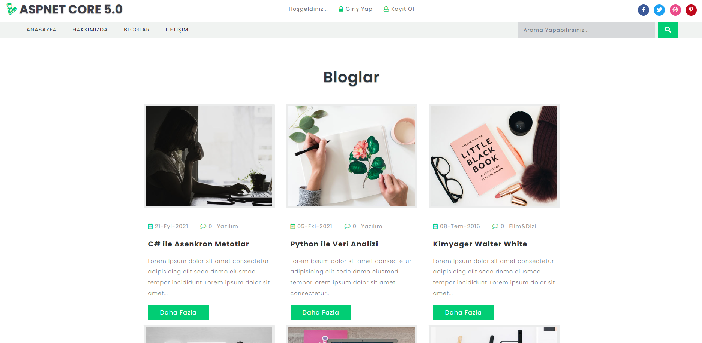

- Blog App uygulamasında çeşitli rollerde kullanıcı bulunmaktadır.  
- Çeşitli özelliklere sahiptir. 
- Site için hazır templateler kullanıldı.  

## Admin
- Admin kullancısı genel olarak sitenin yönetiminden sorumludur.  
- Admin kullanıcıların yaptığı yorumları görür ve yayınlama izni verebilir.  
- Admin paylaşılan yazıları kontrol eder ve yayınlama izni verebilir.  
- Admin çeşitli site istatiklerine erişebilir.  

## Editör 
- Editör kullanıcıların yaptığı yorumları görür ve yayınlama izni verebilir.  
- Editör paylaşılan yazıları kontrol eder ve yayınlama izni verebilir.  

## Writer
- Yazar kendi içeriklerini paylaşabilir.  
- Yazar içeriğine yapılan yorumları görebilir.  

## User
- User paylaşılan içerikleri görür.  
- User paylaşılan içeriklere yorum yapabilir.  

## Geliştirildiği Teknolojiler
| Numara | Teknoloji | 
| :--- | :---: | 
| 1 | .NET Core |
| 2 | MsSQL |
| 3 | JS |
| 4 | HTML5 |
| 5 | CSS  |
| 6 | BOOTSTRAP |

## Ön Gereklilikler ve Kurulum
Aslında projeyi çalıştırmak oldukça basit. Uygulamayı başarılı bir şekilde çalıştırıp kullanmak için bilgisayarınızda en güncel dotnet sdk'sının kurulu olması gerekmektedir. Ardından ise veritabanı için Sql Server veritabanına sahip olmanız gerekmektedir. Kurulumlarınızı eksiksiz tamamladıysanız yapmanız gereken ilk şey migration eklemek olacak bunu Package Manager Console içerisinde "migrations add InitialCreate" komutu yardımıyla yapabilirsiniz. Daha sonra ise bu migration dosyası aracılığı ile veri tabanımızı kurmak için "update-database" komutunu kullanabilirsiniz. Uygulamayı çalıştırdıktan sonra kayıt olabilirsiniz.

### Admin 

Kullanıcı adı : narkoz
Parola : 123456aA@

Bu kullancı adı ve şifreyi kullanarak giriş yapabiliriz. Yeni kullanıcı oluşturmak için kayıt ol seçeneğini seçerek yeni kullanıcı oluşturabiliriz.

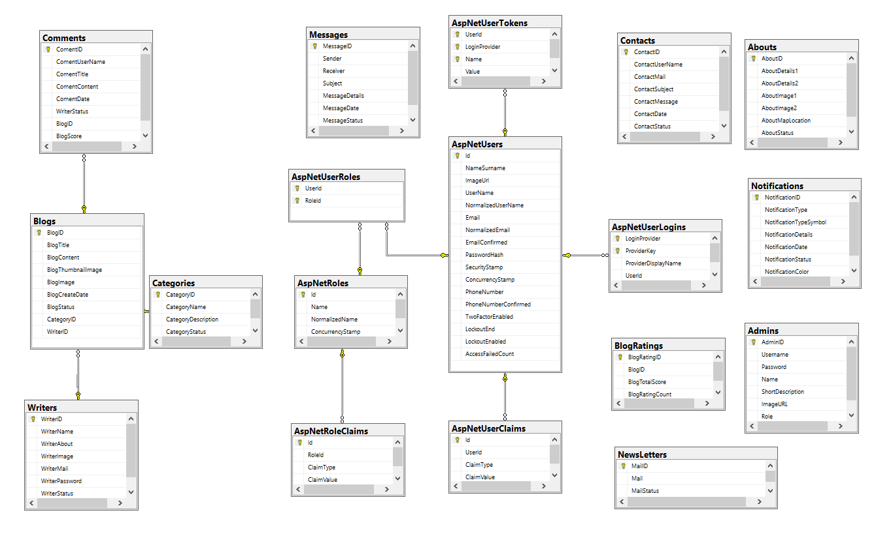
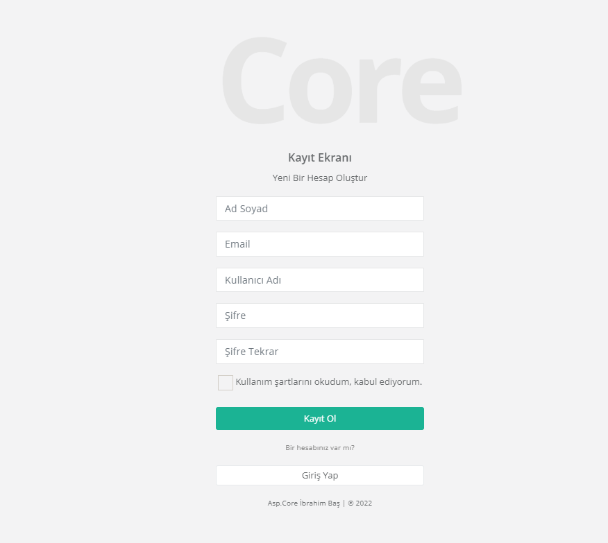
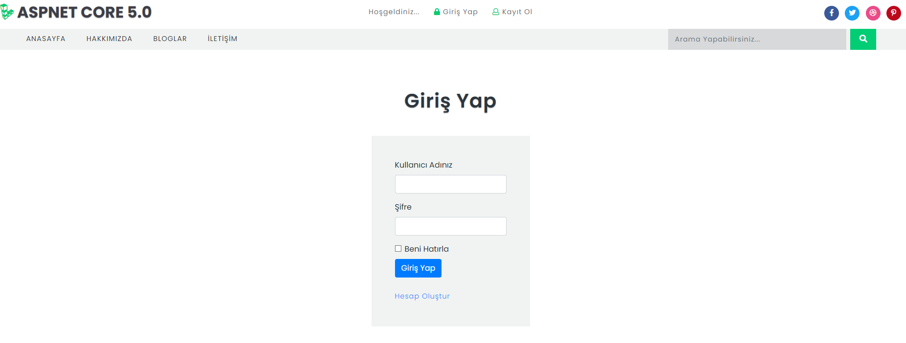
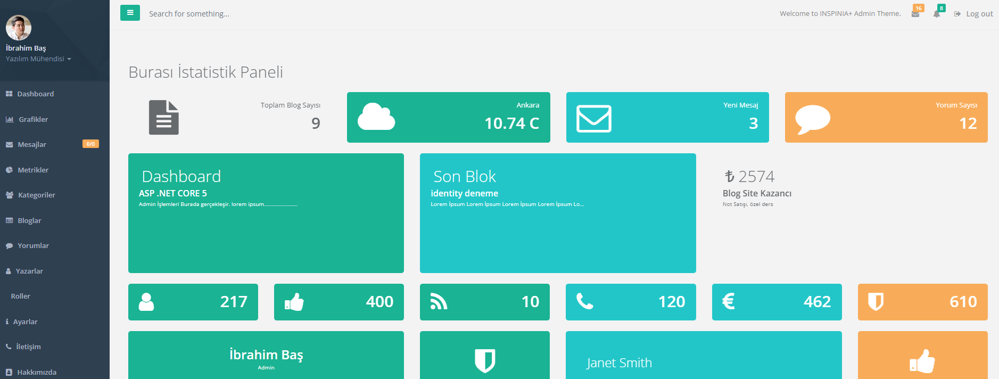
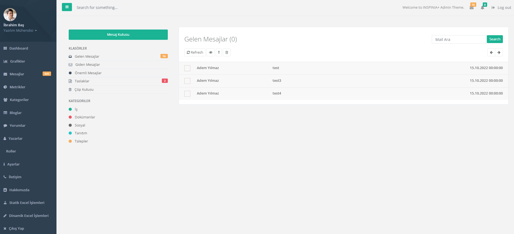
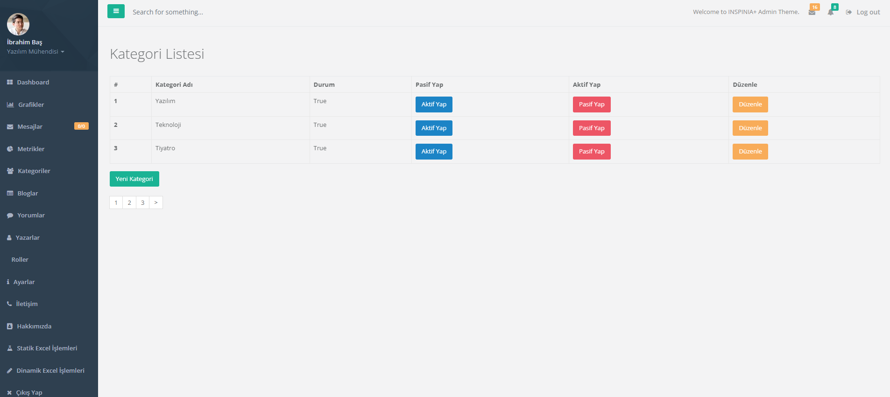
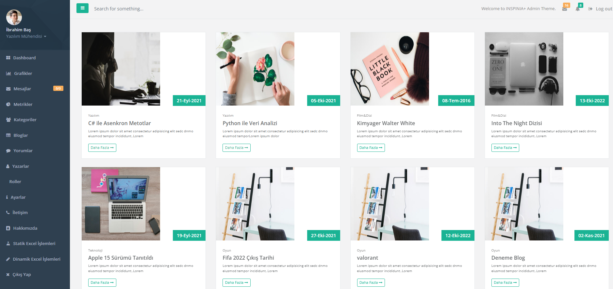

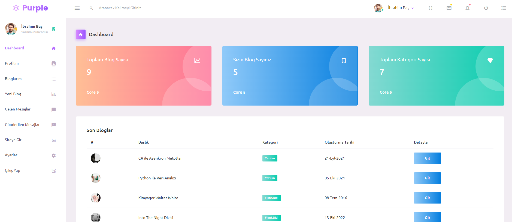
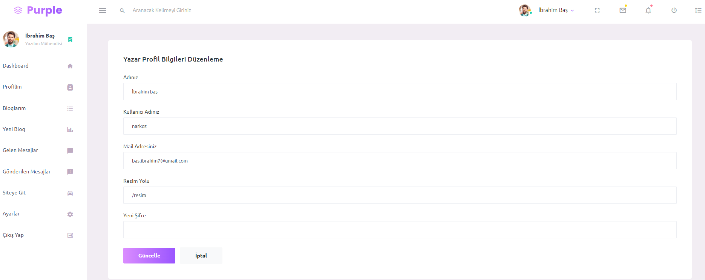
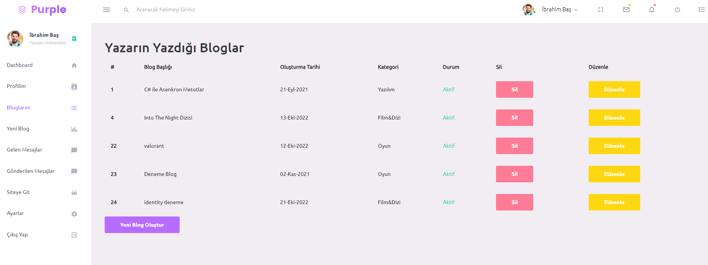
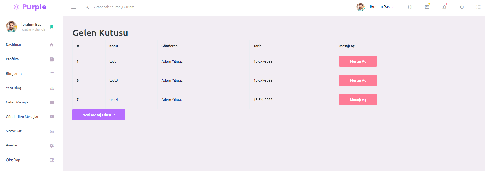

